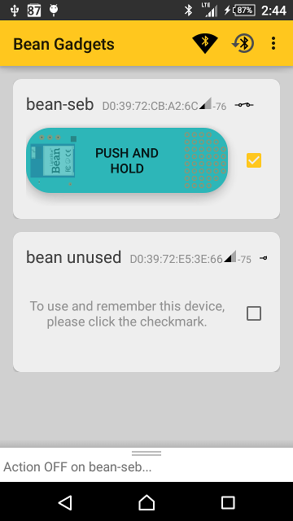

# android-bean-stuff

This is an Android app to control BLE Beans (https://punchthrough.com/bean/).

It is built above the LightBlue Bean Android SDK (https://github.com/PunchThrough/Bean-Android-SDK).

Current features:
* Discover BT devices.
* Select device to be used and remembered.
* Push button turns on+off the LED.

Plans:
* Firmware to indicate per-bean layout (buttons, displays).
* Usage of RxJava and EventBus.
* Libraries AndroidSlidingUpPanel and sdk (of Bean-Android-SDK) to be referred to, instead of included.
